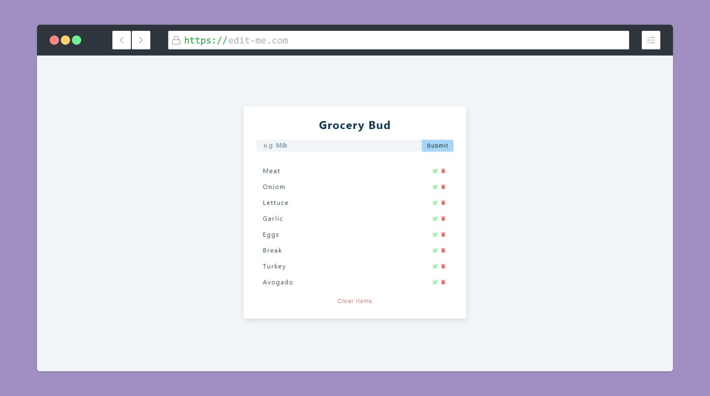

  

 

<h1 align="center">Grocery List</h1>

Grocery list using React and Async storage.

<h1 align="center">
  
</h1>

## Summary

  - [Begin](#Begin)
  - [Requirement](#Requeriment)
  - [Installation](#Installation)
  - [Test](#Test)
  - [Deploy](#Deploy)
  - [Author](#Author)
  - [Useful technologies](#Useful-technologies)

## Begin

Follow the instructions below to run the app.

## Requirements

What do  you need to run.

* **[Node v>=13.8.0](https://nodejs.org/en/)** - Install Node JS in your machine.

### Instalation

- Install all the dependencies.

Execute

    npm install

Or

    yarn install

- Start the project.
 
    npm start

Or

    yarn start

## Test

Executes the test

    npm test

## Deploy

...
 
 
## Author

  - **Mário Batalha**  
   

## Technologies

  - JS
  - React
  - HTML & CSS